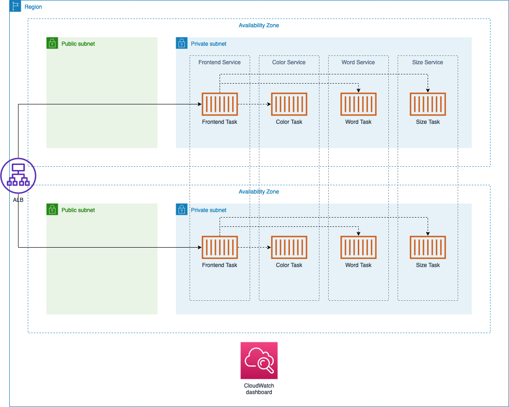

# microservices

This repository contains a demo of a sample microservices-based architecture. The idea of this demo is to easily set up and play around with concepts such as CI/CD deployment techniques, service meshes, service discovery, operational dashboards, etc.

The current implementation supports Amazon ECS, but a Kubernetes version (hosted on Amazon EKS) is also in the works.

### How to deploy (Amazon ECS)

Just launch the CloudFormation template located in `ecs/template.yaml`. You can do this from the AWS Management Console, or you could use the CLI as well:

```
aws cloudformation deploy \
	--stack-name microservices \
	--template-file ./ecs/template.yaml \
	--parameter-overrides \
		FontColorImageUri=carlosafonso/microservices-font-color \
		FontSizeImageUri=carlosafonso/microservices-font-size \
		WordImageUri=carlosafonso/microservices-word \
		FrontendImageUri=carlosafonso/microservices-frontend \
	--capabilities CAPABILITY_IAM
```

Note that all parameters ending in `*ImageUri` default to the public Docker repositories hosted on Docker Hub, but you could use custom images in private repos such as Amazon ECR.

The stack output includes a link to the ALB endpoint, which is the application entry point.

The following architecture diagram illustrates what gets deployed:


