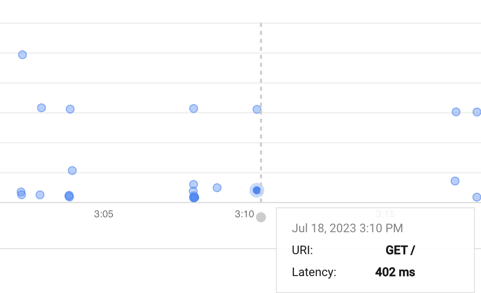
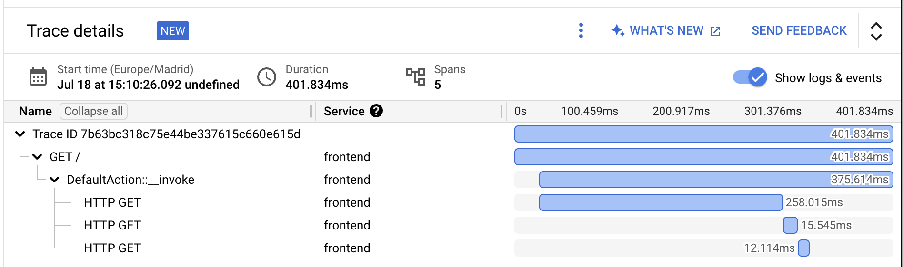
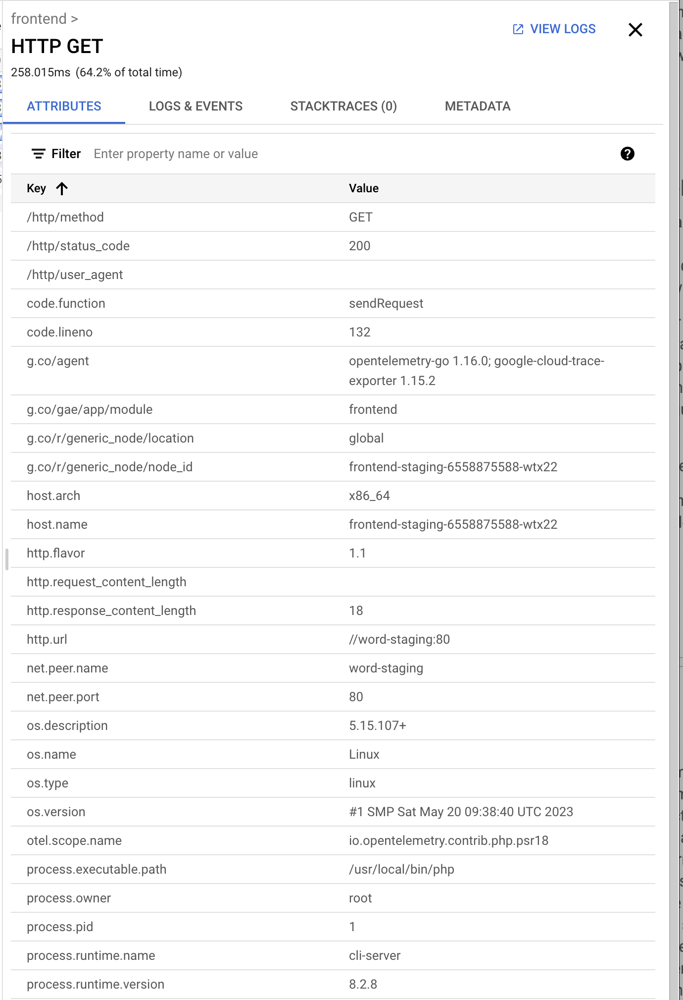

# Tracing demo

This demo showcases the ability to trace requests to the services using OpenTelemetry and Cloud Trace.

> **NOTE:** Currently this is only implemented for the GKE stack. The Cloud Run stack only supports the out-of-the-box tracing integration provided by the service.

1. Retrieve the IP address of the Frontend Service.

```
# This example works on the staging environment. Replace `staging` with `prod` as desired.
FRONTEND_SERVICE_IP=$(kubectl get svc --field-selector="metadata.name=frontend-staging" -o=jsonpath='{.items[0].status.loadBalancer.ingress[0].ip}')
```

2. Make some requests to the service.

```
for i in {1..10}
do
    curl "http://$FRONTEND_SERVICE_IP"
done
```

3. Go to the [Cloud Tracing console](https://console.cloud.google.com/traces/list). The **Trace explorer** view appears and the timeline should contain multiple points, each representing a trace, which is in turn a request to the Frontend Service.



4. Click on any point to select a particular trace. The **Trace details** view is populated with all the spans belonging to the same trace ID.



5. Select any of the spans. A panel opens on the right with the particular details of said span.


