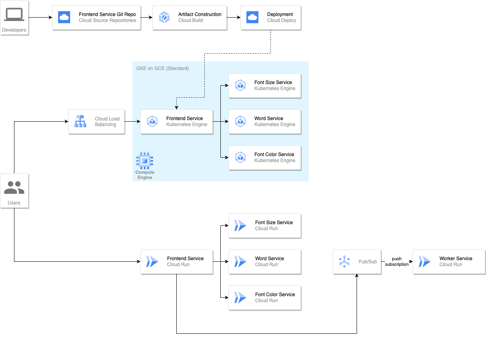

# microservices/gcp

This folder contains an implementation of the microservices demo on top of Google Cloud Platform (GCP).

## Architecture

The current implementation deploys all services on Cloud Run. The Worker Service is push-subscribed to a Pub/Sub topic.



## How to deploy

(Note that this section is currently WIP.)

1. Clone this repo into your Cloud Shell instance.
2. Create a `terraform.tfvars` file with values for the relevant variable.
3. Issue the following command to enable the required GCP APIs:

    ```
    ./enable-services.sh
    ```

4. Deploy the Terraform template.

    ```
    terraform apply -auto-approve
    ```
